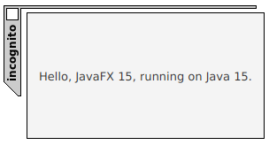

## A minimal jre with javafx

This is an experiment about making a minimal runtime for javafx.

In this case, 'minimal' means being able to start a simple HelloWorld javafx application with the least javafx and jre modules
which turned out to be javafx.base, javafx.graphics, javafx.controls, and java.base (with a couple of other small jdk modules).

Some patches were needed to remove the java.desktop dependency in javafx.base to remove a java.desktop dependency
(four small classes were copied from java/beans to com/sun/javafx/property/adapter).

Some patches were also applied to javafx.graphics to remove non-Linux dependencies as well as printer support (which relied on java.awt.print).

To build the runtime:
1. check out the repository and install a [jdk](https://jdk.java.net/) and javafx [sdk](https://gluonhq.com/products/javafx/)
2. edit the <code>mk*</code> scripts as needed; as they are, the scripts assume the jdk is at <code>/opt/jdk15</code> and the javafx sdk is at <code>/opt/jfx15</code>
3. run <code>./mk</code> which in turn will call the other <code>./mk.*</code> scripts
4. if there are no errors, run the <code>./mk.app</code> script which will compile and run a small app which should show a page that looks something like
   this 
 
